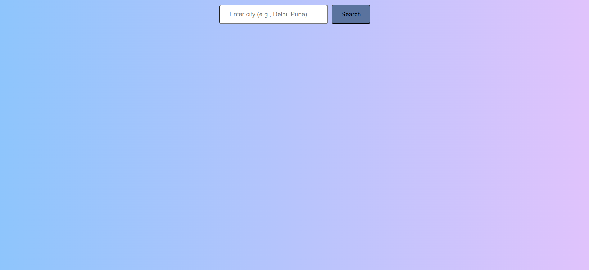
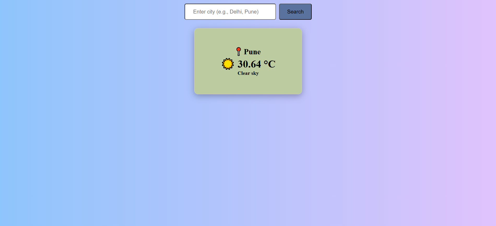
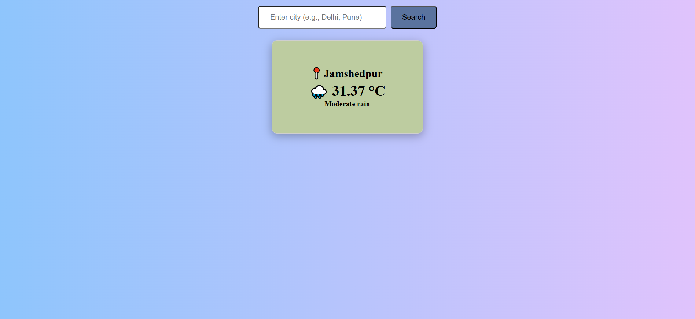
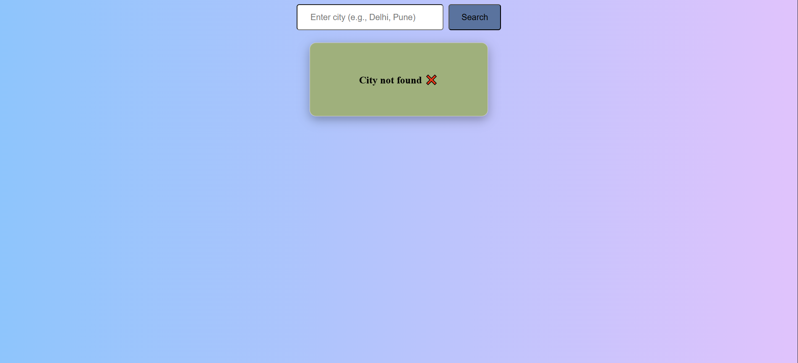

# 🌤️ Weather App

## 📌 Description

A simple and clean weather application that fetches real-time weather data using an API. Users can search for any city and view temperature, weather condition, and description.

---

## 🚀 Live Demo
👉 [Click here to view the project](https://md-tarique-alam.github.io/weather-app/)

---

## 🚀 Features

*  Search weather by city name
*  Displays temperature in Celsius
*  Weather condition with icons
*  Loading state while fetching data
*  Error handling for invalid cities
*  User-friendly messages

---

## 🛠️ Tech Stack

* HTML
* CSS
* JavaScript
* OpenWeather API

---

## 📷 Screenshot

  
  
  
  

---

## 📚 What I Learned

* Working with APIs using `fetch`
* Using `async/await`
* DOM manipulation
* Handling UI states (loading, error, success)
* Object mapping for dynamic UI (weather icons)

---

## 📂 How to Run Locally

1. Download or clone the repository
2. Open `index.html` in your browser

---

## 🔮 Future Improvements

* Add autocomplete city suggestions
* Add weather-based background
* Improve UI animations
